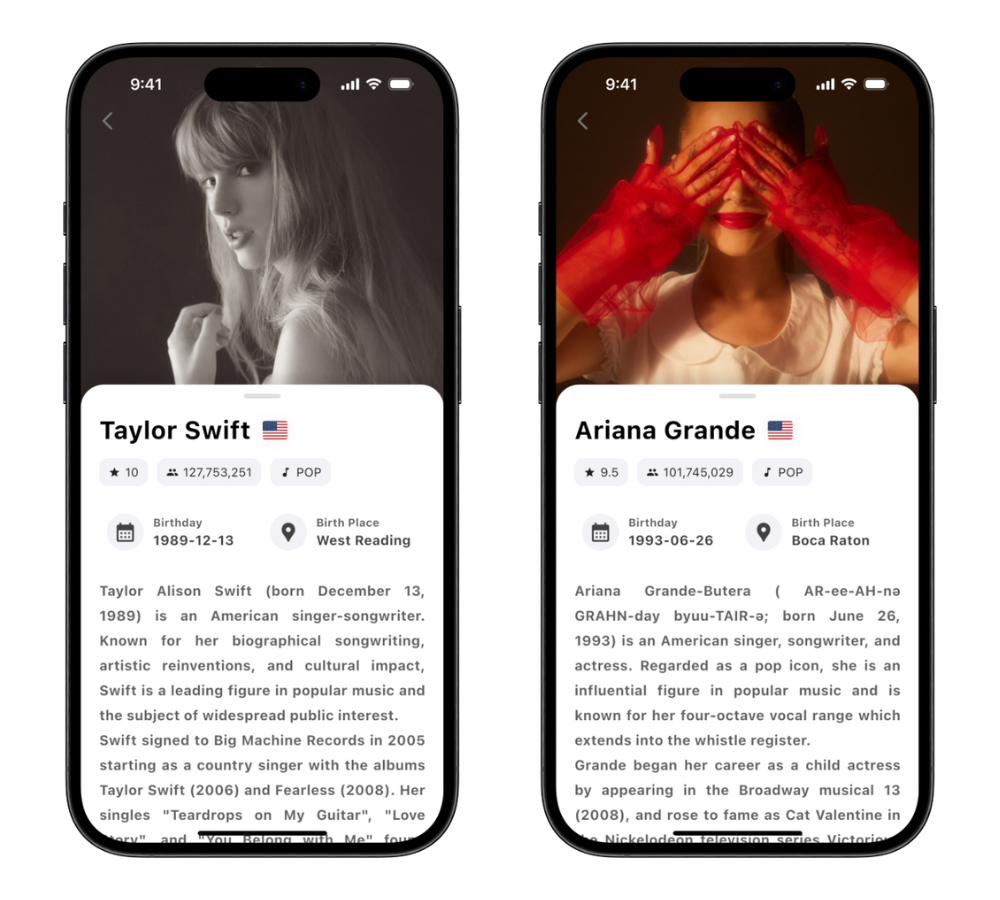

# Artist Profile 🎤

《Artist Profile》是一款整合多方資料來源的應用程式，讓使用者能輕鬆探索歌手。透過串接 Spotify API、Wikipedia API 與 MusicBrainz API，應用程式提供包括歌手圖片、名稱、音樂類型、粉絲數、流行度，以及出生地、出生日期、活躍國家等豐富資訊。此外，維基百科內容支援繁體中文與英文，滿足不同語言需求。App 還搭配智慧搜尋功能，讓使用者即使輸入部分名字或有拼字錯誤，也能精準找到目標歌手。《Artist Profile》透過簡約且美觀的設計，結合流暢的操作體驗，讓音樂探索更加有趣與便利。

## App 展示 📱

### 首頁

### 中英文歌手詳情頁面

### 支援搜尋台灣歌手

### 首頁載入畫面

### 歌手詳情載入畫面

### 搜尋頁面

### 提示對話框

### 通知欄

## 專案架構 🏗

### 使用技術、框架與平台

- **前端**：Flutter、flutter_dotenv、intl、http、cached_network_image、provider、url_launcher、persistent_bottom_nav_bar_v2、sqflite、path、hive

- **後端**：Node.js、Express、axios、SpotifyWebApiNode、p-queue、Dotenv

- **後端部署平台**：Vercel

## 功能 🚀

- **歌手介紹**：
  整合多個 API 提供詳細的歌手資訊

  - **Spotify API**：顯示歌手的照片、名稱、Spotify 人氣、粉絲數量及音樂類型
  - **Wikipedia API**：歌手於維基百科上的資料
  - **MusicBrainz API**：補充歌手的出生日期、出生地、活躍國家等詳細資料

- **搜尋功能**：  
  透過 **Spotify API** 取得結果，即使僅輸入部分名稱或拼字錯誤，也能找到相關歌手（例如輸入 "Taylor" 或 "Tay" 即可找到 "Taylor Swift"）

- **自訂設定**：  
  提供多樣化的設定選項，例如可選擇維基百科內容語言，提升使用的靈活性

## 專案亮點 ✨

- **UI / UX**：  
  《Artist Profile》的亮點在於精緻的 UI 設計，從間距、字體大小、圓角到 `TextOverflow.fade` 的應用等細節，充分考量視覺與操作的舒適性。同時，UX 設計強調流暢的操作體驗，透過如通知欄等互動元素，提供無縫且自然的使用流程

- **快取機制**：

  - **後端快取**：於伺服器端進行快取，確保即使多位使用者同時發起請求，也能有效節省第三方 API 的使用量，提升效能
  - **前端快取**：獲取後端資料後於本地端進行快取，在單位使用者多次發起相同請求時，能於短時間內直接使用本地快取資料，提升反應速度與節省後端流量

- **資料準確性提升**：  
  後端在整合多個第三方 API 資料時，經過多次測試，採用精確關鍵字搜索並進行多層比對，降低使用者獲取錯誤資料的可能性

  - **Spotify API 關鍵字精確搜索**：  
    利用 Spotify 回傳的完整歌手姓名作為基礎，對接 Wikipedia API 與 MusicBrainz API

  - **多層比對與驗證機制**：
    - 透過歌手名稱 + 關鍵字搜尋時，Wikipedia API 有可能搜索不到準確資料，例如搜索到與關鍵字相關但非歌手本人條目或小眾歌手可能沒有維基百科條目等。因此後端會進行檢查，判斷歌手名稱是否存在於 Wikipedia API 回傳的 `extract` 中（如 Taylor Swift 條目內會提及 `Taylor Swift`）。若不包含，表示此條目非該歌手條目，後端會回傳 `null`，並在 App 中提示使用者避免混淆
    - 若通過檢查但實際不正確的條目，例如搜尋「Taylor Swift」時可能返回同名專輯《Taylor Swift》，後端會手動處理此類例外情況，進一步提高資料準確性
    - 在 MusicBrainz API 資料比對中，後端會以 Spotify API 提供的歌手名稱對照 MusicBrainz API 的歌手名稱，僅當名稱完全一致時才回傳資料，確保資料來源準確無誤

- **中文維基百科準確度進一步提升**：  
   當使用者選擇中文作為維基百科語言時，若歌手名稱為英文，後端會採用以下策略提高準確度：

  - 若比對不到正確資料，後端不會直接回傳 `null`，而是改以用歌手名稱搜尋英文維基百科
  - 搜索結果會再次檢查歌手名稱是否包含在 `extract` 中，若包含則回傳，否則回傳 `null`

  相反，當使用者選擇英文作為維基百科語言時，若歌手名稱為中文：

  - 若比對不到正確資料，後端直接回傳 `null`
  - 此策略基於以下考量：使用中文名稱搜尋英文維基百科獲得正確結果的機率較低，且許多中文使用者具備閱讀英文的能力，而英文使用者則較少能讀懂中文，因此不再次檢查

## API 來源 🌐

- **[Spotify API](https://developer.spotify.com/documentation/web-api)**：提供歌手的照片、名稱、Spotify 人氣、粉絲數量及音樂類型，並支援即時搜尋功能

- **[Wikipedia API](https://www.mediawiki.org/wiki/API:Main_page)**：使用 MediaWiki 提供的 API，根據關鍵字搜尋條目內容，並提供多語言選擇（英文或繁體中文）

- **[MusicBrainz API](https://musicbrainz.org/doc/MusicBrainz_API)**：提供歌手的詳細資訊，例如出生日期、出生地及活躍國家等

## 聲明 📌

此 App 所使用的資料皆基於歌手名稱進行 API 查詢，即使後端經過多層處理與比對，仍無法完全保證資料的正確性，請使用者自行確認重要資訊。
